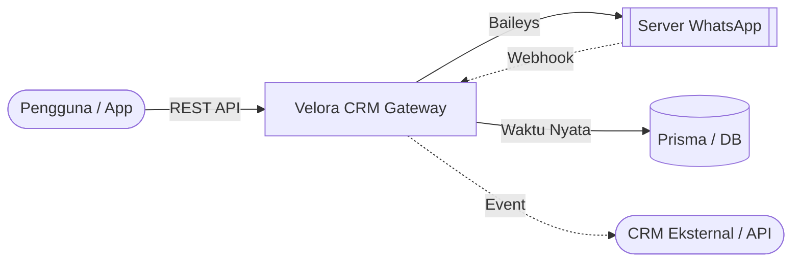

<div align="center">

# 🚀 Velora CRM: Gateway & Dashboard WhatsApp Terbaik

[English](README.md) | [Bahasa Indonesia](README_ID.md)

[](https://wa.me/)
[](https://nextjs.org/)
[](https://www.typescriptlang.org/)
[](https://www.prisma.io/)
[](https://github.com/velora-1d/CRM-Whatsapp/releases)
[](https://github.com/velora-1d/CRM-Whatsapp)

**Sistem Otomatisasi, Dashboard, dan Gateway WhatsApp Multi-Sesi Profesional.**  
Dibuat menggunakan **Next.js 15**, **React**, dan **Baileys** untuk otomatisasi pesan berkinerja tinggi serta layanan Gateway Bot WhatsApp waktu nyata (real-time).

> [!TIP]
> **Mencari fitur terbaru?** Silakan cek [beta branch](https://github.com/velora-1d/CRM-Whatsapp/tree/beta) atau [pre-releases](https://github.com/velora-1d/CRM-Whatsapp/releases) untuk sumber eksperimental kami.

[Fitur](#-fitur-utama) • [Panduan Pengguna](docs/USER_GUIDE.md) • [Dokumentasi API](docs/API_DOCUMENTATION.md) • [Setup Database](docs/DATABASE_SETUP.md) • [Instalasi](#-instalasi-cepat)

</div>

---

## 📖 Dokumentasi Lengkap

Velora CRM dilengkapi dengan dokumentasi ekstensif yang dirancang baik untuk pengembang (developer) maupun pengguna.

- **[Dokumentasi Master Proyek](docs/PROJECT_DOCUMENTATION.md)**: Arsitektur, database, dan alur logika aplikasi.
- **[Dokumentasi API](docs/API_DOCUMENTATION.md)**: Panduan lengkap OpenAPI / Swagger untuk seluruh **109+ endpoint**.
- **[Referensi Cepat API](docs/API-QUICK-REFERENCE.md)**: Memulai integrasi secara instan dengan potongan kode cURL/JavaScript siap pakai.
- **[Variabel Lingkungan](docs/ENVIRONMENT_VARIABLES.md)**: Panduan konfigurasi dan keamanan sistem (.env).

---

## 🌟 Mengapa Memilih Velora CRM WhatsApp API Gateway?

Velora CRM mengubah WhatsApp Anda menjadi API RESTful yang dapat diprogram sepenuhnya. Dirancang untuk skalabilitas, keandalan, dan kemudahan penggunaan, menjadikannya jembatan sempurna antara logika bisnis Anda dan jangkauan global WhatsApp. Sangat cocok untuk membangun **Bot WhatsApp**, Otomatisasi, atau Gateway Layanan Pelanggan (Customer Service).

### 🏗️ Cara Kerja



### 🔥 Fitur Utama

- **📱 Manajemen Multi-Sesi**: Sambungkan dan kelola akun WhatsApp tanpa batas secara bersamaan melalui pemindaian kode QR yang simpel.
- **⚡ Engine WhatsApp Pro**: Ditenagai oleh `@whiskeysockets/baileys` untuk koneksi WebSocket yang cepat, stabil, dan aman.
- **📅 Scheduler Tingkat Lanjut**: Perencanaan pengiriman pesan yang presisi dilengkapi dengan **Dukungan Media** (Gambar, Video, Dokumen).
- **📢 Broadcast Aman**: Mekanisme anti-ban bawaan dengan jeda acak (10-30 detik) dan pemrosesan antrean bertahap.
- **🤖 Balasan Otomatis Pintar**: Pencocokan kata kunci dengan **Dukungan Konteks** (Grup/Pribadi/Semua) serta **Lampiran Media**.
- **🛡️ Kontrol Akses Terperinci**: Dukungan penuh **Whitelist** & **Blacklist** untuk Perintah Bot dan Balasan Otomatis.
- **🔗 Webhook Skala Enterprise**: Penerusan event real-time yang andal untuk pesan, status koneksi, perubahan status pesan, dan grup.
- **📇 Kontak Tingkat Lanjut**: Kelola kontak secara kaya dengan dukungan LID, nama terverifikasi, dan foto profil.
- **🎨 Alat Kreatif**: Pembuat Stiker bawaan dengan penghapus latar belakang otomatis (integrasi `remove.bg`).
- **📘 Spesifikasi Open API**: Terdokumentasi lengkap menggunakan `swagger-ui-react` pada rute `/docs`.

<details>
<summary>📂 <b>Lihat Contoh Payload Webhook</b></summary>

```json
{
  "event": "message.received",
  "sessionId": "xgj7d9",
  "timestamp": "2026-01-17T05:33:08.545Z",
  "data": {
    "key": { "remoteJid": "6287748687946@s.whatsapp.net", "fromMe": false, "id": "3EB0B78..." },
    "from": "6287748687946@s.whatsapp.net",
    "sender": "100429287395370@lid",
    "remoteJidAlt": "100429287395370@lid",
    "type": "TEXT",
    "content": "saya sedang reply",
    "isGroup": false,
    "quoted": {
      "type": "IMAGE",
      "caption": "Ini caption dari reply",
      "fileUrl": "/media/xgj7d9-A54FD0B6F..."
    }
  }
}
```
</details>

---

## 🧩 Integrasi: Dukungan Native n8n

Velora CRM secara native mendukung **n8n**! Anda dapat membuat alur kerja otomatisasi WhatsApp tanpa kode/rendah kode menggunakan community node resmi kami.

[](https://www.npmjs.com/package/n8n-nodes-wa-akg)

- **Action Node**: Kontrol penuh atas pengiriman pesan, grup, sesi, kontak, dan label langsung dari alur kerja n8n Anda.
- **Trigger Node**: Menerima webhook secara instan (Pesan Masuk, Grup Baru Dimasuki, dll.) untuk memicu alur kerja n8n Anda secara otomatis.

👉 **[Lihat di npm (n8n-nodes-wa-akg)](https://www.npmjs.com/package/n8n-nodes-wa-akg)**

---

## 🚀 Instalasi Cepat

### 1. Prasyarat
- Node.js 20+
- PostgreSQL atau MySQL
- Git
- Docker & Docker Compose (Opsional, untuk deployment menggunakan Docker)

### 2. Setup (Instalasi Standar)
```bash
# Kloning dan instal
git clone https://github.com/velora-1d/CRM-Whatsapp.git
cd CRM-Whatsapp
npm install

# Konfigurasi environment
cp .env.example .env
# Edit file .env dan sesuaikan nilai DATABASE_URL, AUTH_SECRET, NEXTAUTH_URL dll.

# Push skema database dan buat akun admin
npm run db:push
npm run make-admin admin@example.com password123
```

### 3. Jalankan Aplikasi
```bash
# Mode Pengembangan (Development)
npm run dev

# Mode Produksi (Production)
npm run build && npm start
```

### 🐋 Deployment Docker (Konfigurasi Instan)

Anda dapat men-deploy aplikasi dan database MySQL-nya secara bersamaan menggunakan Docker Compose tanpa perlu konfigurasi awal yang rumit:

1. **Jalankan Layanan**:
   Masuk ke direktori proyek dan jalankan:
   ```bash
   docker compose up -d
   ```
   Perintah ini akan otomatis membangun aplikasi Next.js, mengunduh MySQL 8.0, membuat tabel database, dan membuat akun SuperAdmin default:
   - **Email**: `admin@example.com`
   - **Password**: `admin123`

2. **Kustomisasi (Opsional)**:
   Untuk mengubah pengaturan bawaan, Anda dapat menyunting variabel lingkungan langsung di file `docker-compose.yml` (seperti `ADMIN_EMAIL`, `ADMIN_PASSWORD`, `AUTH_SECRET`, `TZ`, dll.), atau membuat file `.env` di sebelah `docker-compose.yml`.

---

## 📚 Ringkasan Referensi API

Velora CRM menyediakan API REST yang komprehensif untuk mengintegrasikan pengiriman pesan WhatsApp secara langsung ke aplikasi Anda. Rincian selengkapnya terdapat pada [API_DOCUMENTATION.md](docs/API_DOCUMENTATION.md).

> [!TIP]
> Gunakan **Swagger UI** bawaan untuk eksplorasi interaktif pada rute `/docs`.

| Metode | Endpoint | Deskripsi |
| :--- | :--- | :--- |
| `POST` | `/api/messages/{sessionId}/{jid}/send` | Mengirim teks, media, atau stiker |
| `POST` | `/api/messages/{sessionId}/broadcast` | Pengiriman pesan massal terukur |
| `PATCH` | `/api/sessions/{id}/settings` | Memperbarui konfigurasi sesi |
| `GET` | `/api/groups/{sessionId}` | Mengambil daftar grup yang tersedia |
| `POST` | `/api/webhooks/{sessionId}` | Mendaftarkan webhook pendengar event real-time |
| `POST` | `/api/autoreplies/{sessionId}` | Membuat balasan otomatis berbasis konteks |
| `POST` | `/api/auth/register` | Mendaftarkan pengguna baru melalui web secara aman |

### Contoh: Mengirim Pesan Teks
```bash
curl -X POST http://localhost:3000/api/messages/session_01/62812345678@s.whatsapp.net/send \
  -H "X-API-Key: kunci_api_anda" \
  -H "Content-Type: application/json" \
  -d '{
    "message": { "text": "Halo dari Velora CRM!" }
  }'
```

---

## ⚠️ Masalah yang Diketahui / Batasan

> [!WARNING]
> **Fitur Pembaruan Status (POST `/api/status/update`)**
> 
> Fitur pembaruan status/story WhatsApp saat ini **memiliki masalah teknis** dan sebaiknya dihindari untuk penggunaan produksi:
> - Status teks dengan warna latar belakang kustom mungkin tidak tampil dengan benar.
> - Status media (gambar/video) dapat gagal terunggah ke server WhatsApp.
> - Fitur ini sedang dalam pengembangan aktif.
> 
> Kami menyarankan Anda menunggu rilis berikutnya sebelum menggunakan endpoint ini di alur kerja krusial Anda.

---

## 🛡️ Keamanan
- **Autentikasi Kunci API**: Semua endpoint diamankan menggunakan header `X-API-Key`.
- **RBAC**: Dukungan multi-role (`SUPERADMIN`, `OWNER`, `STAFF`).
- **Penyimpanan Terenkripsi**: Kredensial sensitif disimpan secara aman menggunakan enkripsi bcrypt dan NextAuth.js.

---

<div align="center">
  Dibuat dengan ❤️ oleh <a href="https://github.com/velora-1d">Velora</a>  
  Didistribusikan di bawah Lisensi <a href="LICENSE">MIT</a>
</div>
